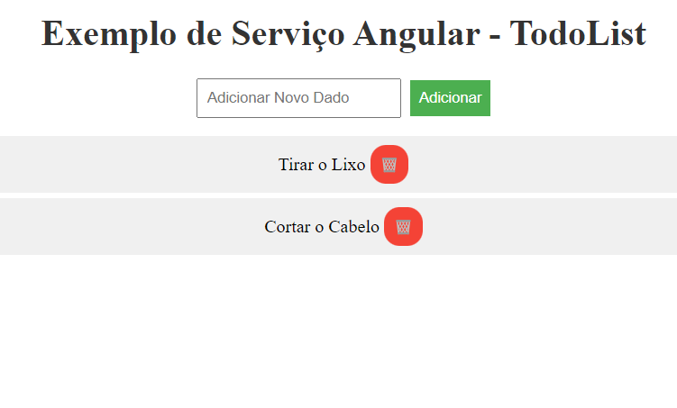

# Atv8 - TodoList - Services Angular



## Implementaçao com React

Se fossemos realizar a mesma implementação de serviços em React teriamos que utilizar Hooks, ou algo similar. O código ficaria mais ou menos assim:

```javascript
import { useState, createContext, useContext } from 'react';

const TodoContext = createContext();

export default function TodoProvider({ children }) {
  const [todos, setTodos] = useState([]);

  const addTodo = (todo) => {
    setTodos([...todos, todo]);
  };

  const removeTodo = (todo) => {
    setTodos(todos.filter((t) => t.id !== todo.id));
  };

  const updateTodo = (todo) => {
    setTodos(
      todos.map((t) => {
        if (t.id === todo.id) {
          return todo;
        }
        return t;
      })
    );
  };

  return (
    <TodoContext.Provider value={{ todos, addTodo, removeTodo, updateTodo }}>
      {children}
    </TodoContext.Provider>
  );
}

export function useTodo() {
  const context = useContext(TodoContext);
  const { todos, addTodo, removeTodo, updateTodo } = context;
  return { todos, addTodo, removeTodo, updateTodo };
}
```

Agora bastaria utilizar esse serviço em qualquer componente da aplicação, por exemplo:

```javascript
import { useTodo } from './TodoContext';

export default function TodoList() {
  const { todos, removeTodo } = useTodo();

  return (
    <div>
      <h1>Todo List</h1>
      <ul>
        {todos.map((todo) => (
          <li key={todo.id}>
            {todo.title} - {todo.description}
            <button onClick={() => removeTodo()}>Remover</button>
          </li>
        ))}
      </ul>
    </div>
  );
}
```


